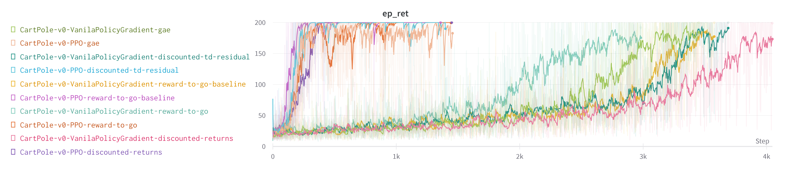

# Policy Optimization implemented with PyTorch

Benchmarking VPG & PPO with various weights ($\Psi$) for the policy gradient term, where $\Psi$ is used as:

$$\begin{align*}
g_\theta :=& \mathbb{E}\big[ \nabla_\theta \log \pi_\theta(a|s) \big] \\
\sim & \mathbb{E}\big[ \sum_{t = 0} ^ \infty  \Psi_t \nabla_\theta  \log \pi_\theta(a_t | s_t ) \big]
\end{align*}$$

# How does this differ from Spinning Up RL's Implementation?

This repo is heavily based on [Spinning Up RL's](https://spinningup.openai.com/en/latest/index.html) implementation of VPG and PPO.

However there are some changes. First, similar to various other object-oriented pipelines such as [Timm](https://github.com/rwightman/pytorch-image-models), [Avalenche](https://avalanche.continualai.org/), etc., we have used pytorch & pythonic OOP structured training for these policy optimization algorithms.

We have also removed some of the features that are not essential to the algorithm themselves, and on the other hand, we have added some new features that are not present in the original implementations.

# Results

Where $\Psi$ is one of:

1. Discounted return:

$$
\Psi_t = \sum_{l = 0} ^ \infty \gamma^l r_l
$$

2. Reward-to-go:

$$
\Psi_t = \sum_{l = 0} ^ \infty \gamma^{t + l} r_{t + l}
$$

3. Reward-to-go with baseline:

$$
\Psi_t = \sum_{l = 0} ^ \infty \gamma^{t + l} r_{t + l} - b(s_t)
$$

Where we have used baseline as $b(s_t) = V(s_t)$.

4. Discounted Temporal Difference Residual:

$$
\Psi_t = \delta_t := r_t + \gamma V(s_{t+1}) - V(s_t)
$$

5. Generalized Advantage Estimation:

$$
\Psi_t = \sum_{l = 0} ^ \infty (\gamma \lambda)^l \delta_{t + l}
$$

Where $\delta_{t}$ is the discounted TD residual defined on 4.

## Note
Using the original definition from the paper proposing [GAE](https://arxiv.org/abs/1506.02438), $\lambda>0$ 
has the same value as 5. By their definition, setting $\lambda=0$
yields 4. But we can see that this is not the case if we evauate using 5. It's not a big deal, because this shenanigan happend since
${0}^{0}$ is not well defined. Follow equation (16) from the paper for more details.

